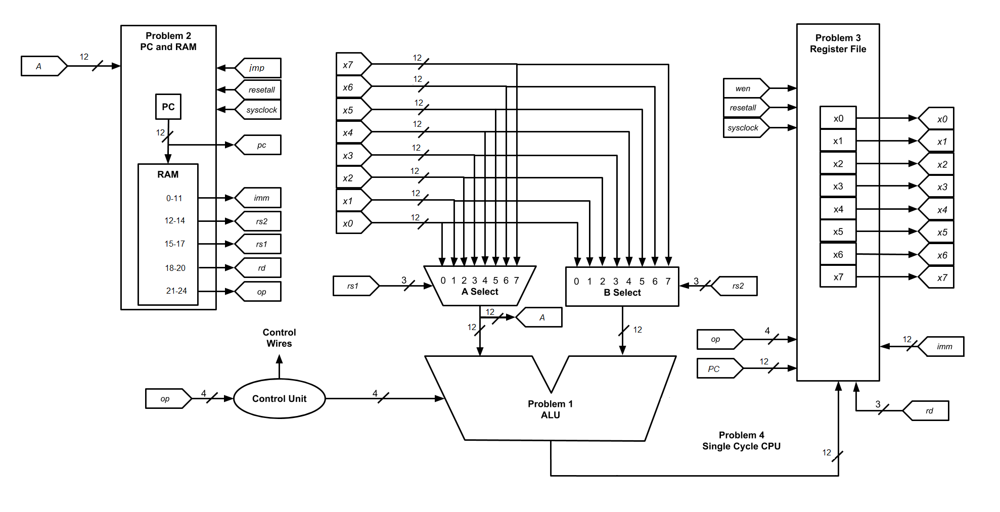

:Author: Daryl Posnett
:Copyright: © 2020 Daryl Posnett, forked from CC repo by Justin Perona
:License: CC BY-NC 4.0

========================
ECS 154A - Lab 3 SS1 2020
========================
.. contents::
  :local:

Logistics
---------

Submission
~~~~~~~~~~

Due by 20:00 on Friday, 2020-07-31.
**There is no late submission for this lab!**
This also means there's no late penalty, yay!

Turn in for the Logisim Evolution portion is on Gradescope.
Submit the specified .circ files for each problem.
The person submitting should specify their partner's name (if necessary) during the submission process.

Logisim Evolution Problems [135]
-------------------------------

Background
~~~~~~~~~~

Your final task (at least, in terms of the labs) will be to build a single cycle CPU.
This is considered a rite of passage for computer architecture courses.
This CPU will be 12 bits wide, and can do various register transfers and ALU operations using point-to-point connections.

In typical fashion for this course, the first couple of problems in this lab have you implement pieces of the CPU in isolation and test them for correct operation.
We start small and build our way up.
This is also set up this way so that you can get some partial credit if you can't complete the entire thing.
However, a good portion of credit for the lab will come from the final problem where you combine your pieces and create a working CPU.
It's much more important to understand how these pieces fit together and build off of each other, hence the point setup.

Below is an outline of the overall CPU design.

CPU Diagram
"""""""""""

You should follow the diagram below when building your CPU.
Some of the control wires are not on the diagram.
You will need to figure out how to implement those yourself.

In the following problems, you will implement the following portions.
See the individual problems for more information on each portion.

#. ALU
#. PC and RAM
#. Register File
#. A Select Unit, B Select Unit, Control Unit, and connecting everything together

CPU Design Philosophy
"""""""""""""""""""""

The design for this machine is different from any that have been produced in industry.
However, it does draw heavily from some previous designs.
Some of the naming conventions for signals in the diagram above have been borrowed from the open-source `RISC-V instruction set architecture`_.
The meaning of some of the names is below:

* *wen*: write enable
* *op*: operation code or opcode
* *rd*: register destination
* *rs1*: register source 1
* *rs2*: register source 2
* *imm*: immediate value
* *x0-x7*: register designation for register 0 through register 7

However, this is not a RISC-V machine.
In case you are interested in learning more about RISC-V, or building your own CPUs in something other than Logisim Evolution, I'd highly recommend taking ECS 154B.
You build multiple RISC-V CPUs in that class using a `hardware design language (HDL)`_ called Chisel_.

.. _`RISC-V instruction set architecture`: https://en.wikipedia.org/wiki/RISC-V
.. _`hardware design language (HDL)`: https://en.wikipedia.org/wiki/Hardware_description_language
.. _Chisel: https://www.chisel-lang.org/

Instruction Format
""""""""""""""""""

The following table describes how a 25-bit instruction for this CPU will be formatted:

+----------+----------+-------------------------------+--------------------------------------------------------------------------------+
| **Name** | **Bits** | **Function in CPU**           | **Description**                                                                |
+----------+----------+-------------------------------+--------------------------------------------------------------------------------+
| *op*     | 24 - 21  | ALU Control                   | Determines which operation to perform and immediate mode operand sourcing.     |
+----------+----------+-------------------------------+--------------------------------------------------------------------------------+
| *rd*     | 20 - 18  | Register File Register Select | Destination register specification.                                            |
+----------+----------+-------------------------------+--------------------------------------------------------------------------------+
| *rs1*    | 17 - 15  | A Select Unit Control         | Primary source register specification.                                         |
+----------+----------+-------------------------------+--------------------------------------------------------------------------------+
| *rs2*    | 14 - 12  | B Select Unit Control         | Secondary source register specification. Not always used on every instruction. |
+----------+----------+-------------------------------+--------------------------------------------------------------------------------+
| *imm*    | 11 - 0   | Immediate Value Input Data    | Unsigned input data. Not always used on every instruction.                     |
+----------+----------+-------------------------------+--------------------------------------------------------------------------------+

Operation Description
"""""""""""""""""""""

The following table describes what the opcode from the table above corresponds to in terms of operation.
All operations, except for JMP, HLT, and HCF, place their results in the destination register *rd*.

In the table below *r* refers to the contents of the register, not the three bit reference to the register.
For example, "Bitwise AND of *rs1* and *rs2* means to compute the AND of the contents of the register referenced
by *rs1* and *rs2*.

+----------------+----------------+----------------------------------------------------------------------------------------------------------------------------------------------------------------------+
| **Operation**  | **op [24-21]** | **Description**                                                                                                                                                      |
+----------------+----------------+----------------------------------------------------------------------------------------------------------------------------------------------------------------------+
| NOT            | 0000           | Negate *rs1*; place the result in *rd*.                                                                                                                              |
+----------------+----------------+----------------------------------------------------------------------------------------------------------------------------------------------------------------------+
| AND            | 0001           | Bitwise AND of *rs1* and *rs2*; place the result in *rd*.                                                                                                            |
+----------------+----------------+----------------------------------------------------------------------------------------------------------------------------------------------------------------------+
| XOR            | 0010           | Bitwise XOR of *rs1* and *rs2*; place the result in *rd*.                                                                                                            |
+----------------+----------------+----------------------------------------------------------------------------------------------------------------------------------------------------------------------+
| OR             | 0011           | Bitwise OR of *rs1* and *rs2*; place the result in *rd*.                                                                                                             |
+----------------+----------------+----------------------------------------------------------------------------------------------------------------------------------------------------------------------+
| ADD            | 0100           | Add *rs1* and *rs2*; place the result in *rd*.                                                                                                                       |
+----------------+----------------+----------------------------------------------------------------------------------------------------------------------------------------------------------------------+
| SUB            | 0101           | Subtract *rs2* from *rs1*; place the result in *rd*.                                                                                                                 |
+----------------+----------------+----------------------------------------------------------------------------------------------------------------------------------------------------------------------+
| MOV            | 0110           | Copy *rs1* as is; place the result in *rd*.                                                                                                                          |
+----------------+----------------+----------------------------------------------------------------------------------------------------------------------------------------------------------------------+
| MSW            | 0111           | Copy *sw* to *rd*. For this operation, *sw* should contain the status value from the last operation.                                                                 |
+----------------+----------------+----------------------------------------------------------------------------------------------------------------------------------------------------------------------+
| MPC            | 1000           | Copy *pc* to *rd*.                                                                                                                                                   |
+----------------+----------------+----------------------------------------------------------------------------------------------------------------------------------------------------------------------+
| MVI            | 1001           | Copy *imm* as is; place the result in *rd*.                                                                                                                          |
+----------------+----------------+----------------------------------------------------------------------------------------------------------------------------------------------------------------------+
| CMP            | 1010           | Compare. If *rs1* == *rs2*, output a 1, otherwise output 0; place the result in *rd*.                                                                                |
+----------------+----------------+----------------------------------------------------------------------------------------------------------------------------------------------------------------------+
| JMP            | 1011           | Copy contents of *rs1* to  *pc*                                                                                                                                      |
+----------------+----------------+----------------------------------------------------------------------------------------------------------------------------------------------------------------------+
| SLL            | 1100           | Shift all bits of *rs1* to the left by 1, discard the left-most bit, and make the least significant bit 0; place the result in *rd*.                                 |
|                |                +----------------------------------------------------------------------------------------------------------------------------------------------------------------------+
|                |                | SLL stands for Shift Left Logical. Example: 1011 -> 0110.                                                                                                            |
+----------------+----------------+----------------------------------------------------------------------------------------------------------------------------------------------------------------------+
| SRL            | 1101           | Shift all bits of *rs1* to the right by 1, discard the right-most bit, and make the most significant bit 0; place the result in *rd*.                                |
|                |                +----------------------------------------------------------------------------------------------------------------------------------------------------------------------+
|                |                | SRL stands for Shift Right Logical. Example: 1011 -> 0101.                                                                                                           |
+----------------+----------------+----------------------------------------------------------------------------------------------------------------------------------------------------------------------+
| HLT            | 1110           | Halt. Stop the CPU from executing any further instructions until a reset. The PC will continue to increment.                                                         |
+----------------+----------------+----------------------------------------------------------------------------------------------------------------------------------------------------------------------+
| HCF            | 1111           | Stop the CPU from executing any further instructions until a fire extinguisher (reset) is used. The PC will no longer increment until the fire extinguisher is used. |
|                |                +----------------------------------------------------------------------------------------------------------------------------------------------------------------------+
|                |                | HCF stands for `Halt and Catch Fire`_. The CPU literally halts and catches fire.                                                                                     |
+----------------+----------------+----------------------------------------------------------------------------------------------------------------------------------------------------------------------+

.. _`Halt and Catch Fire`: https://en.wikipedia.org/wiki/Halt_and_Catch_Fire

Constraints
"""""""""""

For these problems, you must use designs relying on only the following, unless specified otherwise:

* the Logisim Evolution Wiring library
* the Logisim Evolution Gates library
* the Logisim Evolution Plexers library
* flip flops, RAM, registers, and counters from the Logisim Evolution Memory library
* shifters and comparators from the from the Logisim Evolution Arithmetic library

ROMs are explicitly disallowed.
Adders and subtractors are also explicitly disallowed.
Make them via gates like you have in the past.

1. 12-bit ALU [15]
~~~~~~~~~~~~~~~~~

* Submission file for this part: *1.circ*
* Main circuit name: *alu12*
* Input pin(s): *a* [12], *b* [12], *op* [4], *sysclock* [1]
* Output pin(s): *alur* [12]

Create a 12-bit ALU using your ALU from the previous lab as a starting point. Think about 
what additional structures you might need additionally here to make this CPU work. Also, you must
removed elements that are not needed, you will lose points if you faile to do so. There
is not very much to this portion of the lab, so don't spend too much time overthinking this. 

This portion of the CPU handles the calculations based on stored and current input values.

Note: sysclock has been added as an input so that you may use the built in register to hold
your status word. 

Operations
""""""""""

Based on the *opcode*, the ALU will perform a certain operation.
The result of the operation is output as *alur*.
For details on which operation is which *op* value, check the `Operation Description`_ section above.

Note that HLT, and HCF don't actually use the ALU.
Those opcodes won't be provided in this problem.
When combining everything together, you will need to figure out how to handle those three instructions.

**when importing your CLA from a previous part, don't use the Load Library feature!**
The autograder expects only the named files.
Your CLA and any other subcircuits needs to be in the same file as your main circuit file, *not a separate one.*
You can use the *Merge...* feature instead to import your CLA or other subcircuit.

The adder/subtractor has the same basic requirments as lab2, if you did not finish it in lab2, you will need
to finish it now and the grading requirements for that portion will be the same. See lab2 for details. 

If anything above is confusing, look at the lecture notes on adders, or ask on Canvas.

Make sure that for the MSW instruction that you route the status properly. Since the ALU is the only place
that this data is available, the routing must be a part of the ALU. 

Note: When routing the status word to the output, the zero flag should be bit 0, the carry flag should be bit 1, 
and the overflow flag should be bit 2. All other bits must be set to zero. You need to think about how you will
hold the status word for the last operation so that it can be supplied when the ALU receives a MSW instruction.  
This is a little bit tricky, think about under what conditions you want to read the held data, and under which 
conditions you want to write the held data.  

2. PC and RAM [35]
~~~~~~~~~~~~~~~~~~

* Submission file for this part: *2.circ*
* Main circuit name: *instructions*
* Input pin(s): *resetall* [1], *sysclock* [1], *jmp* [1], *a* [12],
* Output pin(s): *pc* [12], *op* [4], *rd* [3], *rs1* [3], *rs2* [3], *imm* [12]

Create the program counter (PC) and the random access memory (RAM) that stores the instructions and outputs the current instruction.
This portion of the CPU gives the commands to the remainder of the CPU to calculate and store values.

Program Counter
"""""""""""""""

The PC will be an 12-bit presettable up-counter that starts at 0 and wraps around upon saturation. In addition,
you will need to be able to preset the counter to a value provided by the register speceified by *rd*.  This should 
happen whenever the *jmp* input is asserted. I have to allow registers for the next part, and you can make a counter 
pretty easily out of a register and an adder or ALU. You may not use the built-in counter module for the PC. 

Think carefully about how you can build a counter that can be reset to either zero, or preset to some other value.
There are several ways to solve this problem, some are easier than others. We have done something similar in a 
previous lab. 

The output of the PC, *pc*, will feed the RAM the memory location of the instruction it should output.
In addition, you will need to attach the *resetall* signal to the reset pin of  your PC.
When *resetall* is asserted, the PC should be reset to 0.
This is used to reset the CPU back to the start.

Note that the diagram does not include the internal details of the routing of *regA* to the PC. 

Random Access Memory
""""""""""""""""""""

The output of the PC, *pc*, will be fed to a 4096 entry x 25 data RAM module with separate load and store ports.
We will only use the RAM as a source of instructions, so we will not use the store port.
The address bits will be sourced from the output of your PC.
The output of the RAM will be the relevant pieces of the instruction that you should be executing on this cycle.

Make sure to change the databus implementation over to separate databuses for reading and writing.
You will need to hook up *sysclock* to the C3 pin of the RAM.
In addition, make sure to hook up a ground module to the M1 pin of the RAM, and a power module to the M2 pin of the RAM.
Doing these will ensure that the RAM outputs the instruction value and does not attempt to overwrite any data.

Loading Programs
""""""""""""""""

If you are manually testing this subcircuit, you will want to set the initial contents of your RAM to the tester file *ram/cpu.txt*.
If you click on the RAM, on the left sidebar there is an option for *Initial contents* that you'll want to use.

When you are testing this via the tester, you'll need to make a slight change to the command line argument you use.
You should add ``-load ram/cpu.txt`` to the end of the command.
This tells Logisim Evolution to load the RAM in your subcircuit with the expected program.
Thus, a full command for the tester for this part will look like this:

.. code-block:: bash

    java -jar logisim-evolution.jar tester/2tester.circ -tty table -load ram/cpu.txt > output.txt
    diff output.txt tsv/2.tsv

There should only be one RAM in this circuit or any subcircuits used in this file.
Make sure the address and data sizes are correct.
We will attempt to load the RAM with the tester program via the ``-load`` command line argument.
This command will attempt to load *every* RAM with the file we specify.
Having more than one will lead to undesired results.
Using a ROM will prevent us from loading programs and you will get a 0.

3. Register File [35]
~~~~~~~~~~~~~~~~~~~~~

* Submission file for this part: *3.circ*
* Main circuit name: *regfile*
* Input pin(s): *rd* [3], *alur* [12], *pc* [12], *imm* [12] *op*[4], *wen* [1], *resetall* [1], *sysclock* [1]
* Output pin(s): *x0* [12], *x1* [12], *x2* [12], *x3* [12], *x4* [12], *x5* [12], *x6* [12], *x7* [12]

Create an twelve-bit eight-register register file.
This portion of the CPU provides the storage for the rest of the CPU.

Although a CPU would normally store output in memory (RAM), we will not be dealing with memory in this lab.
Instead, we will treat the values of the registers as the "output" of this CPU, hence all the output pins.

Write Enable and Reset
""""""""""""""""""""""

On the rising edge of *sysclock*, if the *wen* signal is asserted, the register corresponding to the appropriate *rd* value will be written with either *alur* (ALU Result), *pc*,
or *imm*. You must use the *op* input to deteremine which signal is routed into the register file and create the appropriate logic to select the correct input. 
The registers' current values will be output as *x0* through *x7*.
Hint: a decoder will be very useful here.

Note that in this problem, *wen* will be provided for you. 
You should hook this up to the appropriate pin on the register module.
When combining everything together, you will need to determine when *wen* should be 0 or 1.

Additionally, you will need to attach the *resetall* signal to the reset pin of your registers.
When this signal is asserted, all registers should be reset to 0.
This is used to reset the CPU back to the start.

Data Routing
~~~~~~~~~~~~

Note that the immediate value routes into this circuit as well as *pc*. 
When we say "immediate value," we mean the last 12 bits contained with the instruction itself.
For the MVI instruction, the register data source should be the 12 immediate bits from the instruction.
For the MPC instruction, the register data source should be the PC value taken from the program counter. 

Subcircuits and Constraints
"""""""""""""""""""""""""""

You should (and effectively must) use registers to implement this problem.
Flip flops don't have a write enable pin, which causes an interesting side effect when playing with the clock on attempting to disable a write.

You may not use RAM to implement your register file; doing so will result in a 0 for this problem.
Using a RAM will cause your CPU to break when we use the ``-load`` command line argument for the next problem.

4. Single Cycle CPU [50]
~~~~~~~~~~~~~~~~~~~~~~~~

* Submission file for this part: *4.circ*
* Main circuit name: *cpu*
* Input pin(s): *resetall* [1], *sysclock* [1]
* Output pin(s): *pc* [12], *x0* [12], *x1* [12], *x2* [12], *x3* [12], *x4* [12], *x5* [12], *x6* [12], *x7* [12]

Finally, put all the pieces together from the previous parts and build your single cycle CPU according to the diagram.
A good portion of credit for the lab is on this problem.

This part doesn't take many extra components to implement, not including the subcircuits for the previous parts.
You shouldn't be adding a ton of extra logic here, but you will need to spend some time and think about what you're implementing.
When importing the subcircuits from the previous parts, you can use the *Merge...* option under *File* in the menu bar.
This way, you don't need to copy and paste.

Your only input pins here are *sysclock* and *resetall*.
*sysclock* is used to make sure the tester circuit and your CPU stay in lockstep.
*resetall* won't be used for this part but may be helpful for your manual testing.
Make sure to hook these inputs up to both the PC, the register file, and any flip flops you add in this circuit specifically.

The output pins are *pc* and *x0* through *x7*.
*pc* is used to make sure your PC is incrementing correctly (or not, depending on the situation).
*x0* through *x7* is to check your CPU for correctness.

Here's some more detail on the other parts of the CPU you haven't implemented yet:

A/B Select
""""""""

These multiplexers select between the different registers for the A and B input into the ALU.
*rs1* specifies which register becomes A, *rs2* will specify which register becomes B.

Program Counter Special Cases
"""""""""""""""""""""""""""""

There are two special cases you need to deal with for the PC that you did not need to deal with before.
Control wires from your control unit will be a good way to handle these cases.
It is up to you to figure out how to implement the functionality for both.

It is possible to implement both of these special cases without modifying your subcircuits for any of the pieces you've made already.
Feel free to modify your subcircuits for those parts if you think you need to.
That said, make sure to only modify the subcircuits inside this problem instead of your previous ones.
If you make changes to the previous ones, then they may fail the autograder.

* If a HLT instruction was decoded, then the PC still needs to advance.

  * Any future instructions after the HLT (except for HCF) should not modify the CPU until the *resetall* signal is given.
  * If HCF is detected afterwards then that takes precedence.

    * Even if you've halted, you can't exactly ignore being set on fire.
    * Perform the same functionality below if you detect an HCF after a HLT.

  * It is possible that *resetall* is not given at all and the PC will roll over.

* If a HCF instruction was decoded, then the PC needs to stop completely.

  * Your CPU is on fire now. Hopefully you have insurance.
  * The PC should stay at the value when *hcf* was asserted.

    * Your CPU doesn't need to recover from an HCF via a *resetall* trigger.
    * In my own testing, the RAM won't advance even after *resetall* is triggered.
    * If you need to reset your CPU during manual testing, you can use ``Ctrl-R`` to do so.

  * Hint: there's at least two ways of doing this.

    * One way will be very similar to the logic for implementing HLT above. However, if you do it this way, you will need to modify the PC and RAM subcircuit.
    * Another mechanism would be to modify *sysclock* specifically for the PC subcircuit.

Control Unit
""""""""""""

The control unit contains the logic to set the ALU to perform the correct operation.
You can pass *op* along as is to the ALU.

The control unit also generates control wires for the rest of the CPU to use.
The exact wires are up to you.
Here are some recommendations:

* You'll want to figure out how to generate *wen* here.

  * In the register file problem, the value was given to you.
  * You will need to figure out when it should be 0 or 1 and generate it yourself now.

* You'll probably want to design logic for HLT and HCF here as well.

  * It'll be helpful to do so here rather than inside the PC and RAM subcircuit.
  * See the `Program Counter Special Cases`_ section for more information on HLT and HCF.

* You'll want to think about how to generaete *jmp* here as well. 

Loading Programs
""""""""""""""""

If you are manually testing this subcircuit, you will want to set the initial contents of your RAM to the tester file *ram/cpu.txt*.
If you click on the RAM, on the left sidebar there is an option for *Initial contents* that you'll want to use.

When you are testing this via the tester, you'll need to make a slight change to the command line argument you use.
You should add ``-load ram/cpu.txt`` to the end of the command.
This tells Logisim Evolution to load the RAM in your subcircuit with the expected program.
Thus, a full command for the tester for this part will look like this:

.. code-block:: bash

    java -jar logisim-evolution.jar tester/4tester.circ -tty table -load ram/cpu.txt > output.txt
    diff output.txt tsv/4.tsv

There should only be one RAM in this circuit or any subcircuits used in this file.
Make sure the address and data sizes are correct.
We will attempt to load the RAM with the tester program via the ``-load`` command line argument.
This command will attempt to load *every* RAM with the file we specify.
Having more than one will lead to undesired results.
Using a ROM will prevent us from loading programs and you will get a 0.

Assembler
"""""""""

There is a Python 3 script inside the *assembler/* subdirectory.
You can use this to build your own programs for further testing or your own experimentation.

Use the ``-h`` flag to understand how the assembler expects its command line arguments.
The input CSV file should look similar to *ram/cpu.csv*.

Other Considerations
""""""""""""""""""""

If you add any other flip flops to your circuit here, make sure to hook them up to *sysclock* so they stay in sync with the grader circuit.
Also, make sure to hook up the *resetall* pin to them as well so that they reset correctly.

Testing and Grading
~~~~~~~~~~~~~~~~~~~

The tester file for this part contains a test program that is a randomized stress tester using a pseudo-random number generator.

Constraints
~~~~~~~~~~~

You may use anything from the following for this problem:

* the Logisim Evolution Wiring library
* the Logisim Evolution Gates library
* the Logisim Evolution Plexers library
* the Logisim Evolution Arithmetic library
* flip flops and registers from the Logisim Evolution Memory library

You may not use ROMs or RAM; doing so will result in a 0.
Make your storage out of flip flops or register modules.
